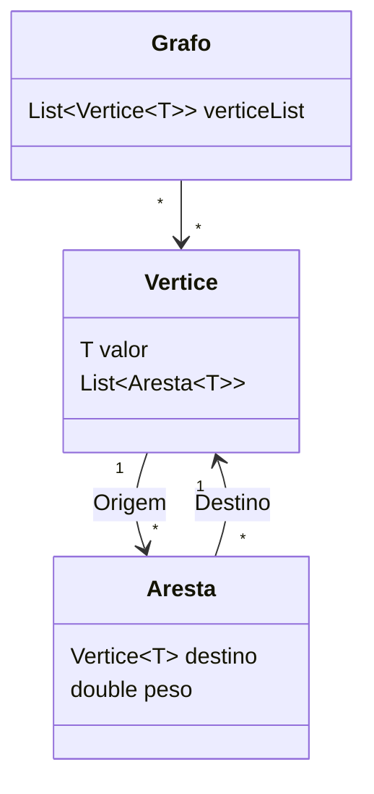

# Lib
Pasta da biblioteca de grafos

## Método de Implementação
Lista de Adjacências
## Diagrama de Classes da Lib

```mermaid
classDiagram

    class Grafo{
        List~Vertice~T~~ verticeList
    }

    class Aresta{
        Vertice~T~ destino
        double peso
    }

    class Vertice{
        T valor
        List~Aresta~T~~
    }

    Grafo "*" --> "*" Vertice
    Vertice "1" --> "*" Aresta : Origem
    Aresta "*" --> "1" Vertice : Destino
```